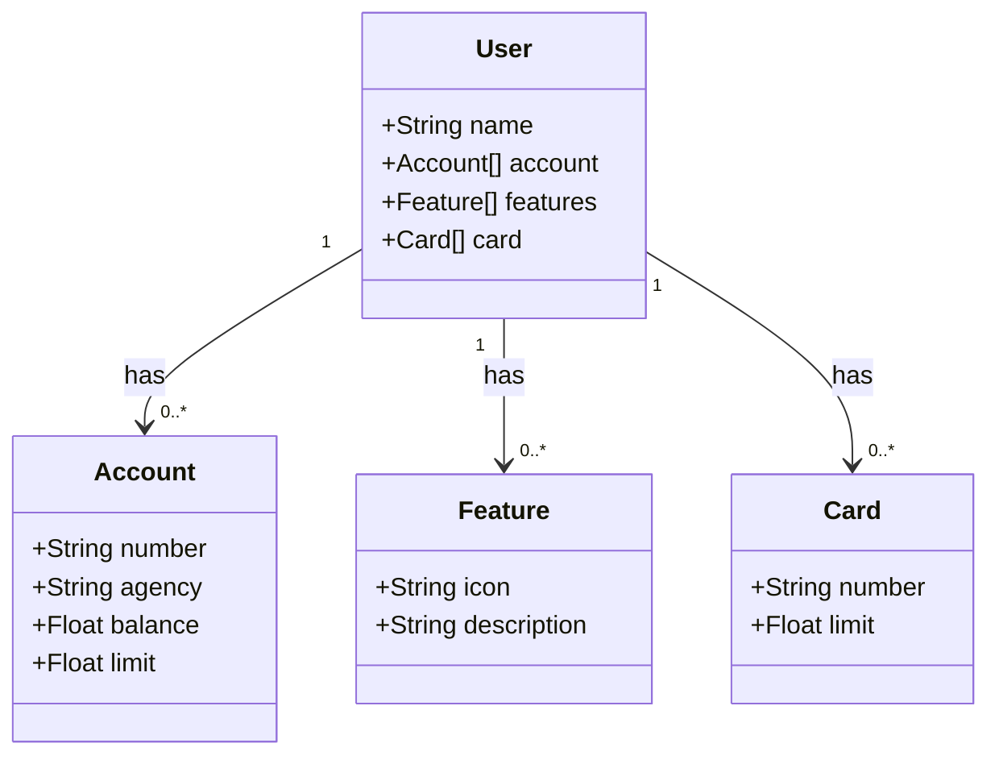

# API REST na Nuvem - Projeto Backend Java

## Sobre

Este projeto trata-se de uma API REST desenvolvida com **Spring Boot 3**, **Java 17** e **Railway**. Ele foi criado como parte do **Bootcamp Avanade 2025** e tem como objetivo fornecer uma solução eficiente para gerenciamento de usuários e contas bancárias.

### Tecnologias Principais

- **Java 17**: Usamos a versão LTS mais recente do Java para garantir a estabilidade e aproveitar as últimas melhorias dessa poderosa linguagem.
- **Spring Boot 3**: A nova versão do Spring Boot maximiza a produtividade do desenvolvedor por meio da autoconfiguração e convenções inteligentes.
- **Spring Data JPA**: Facilitamos a interação com bancos de dados SQL, proporcionando uma camada de persistência robusta e fácil de usar.
- **OpenAPI (Swagger)**: Para facilitar a documentação e interação com a API, utilizamos o OpenAPI (Swagger), permitindo uma visão clara e acessível dos endpoints da aplicação.
- **Railway**: Utilizamos a plataforma Railway para o deploy e monitoramento da API, além de contar com integração contínua e pipelines CI/CD.

## Diagrama de Classes (Domínio da API)

O diagrama de classes é representado conforme o modelo de domínio da aplicação e foi projetado para facilitar o entendimento das entidades que compõem o sistema.

## Documentação da API

A documentação da API está disponível através do Swagger. Acesse a documentação e explore os endpoints da API diretamente no link abaixo:

[Documentação da API (Swagger)](https://sdw-2023-prd.up.railway.app/swagger-ui.html)

A API estará disponível no **Railway** por tempo limitado, mas o código-fonte é aberto, permitindo que você faça um fork, modifique ou execute localmente para seus próprios projetos.

---

